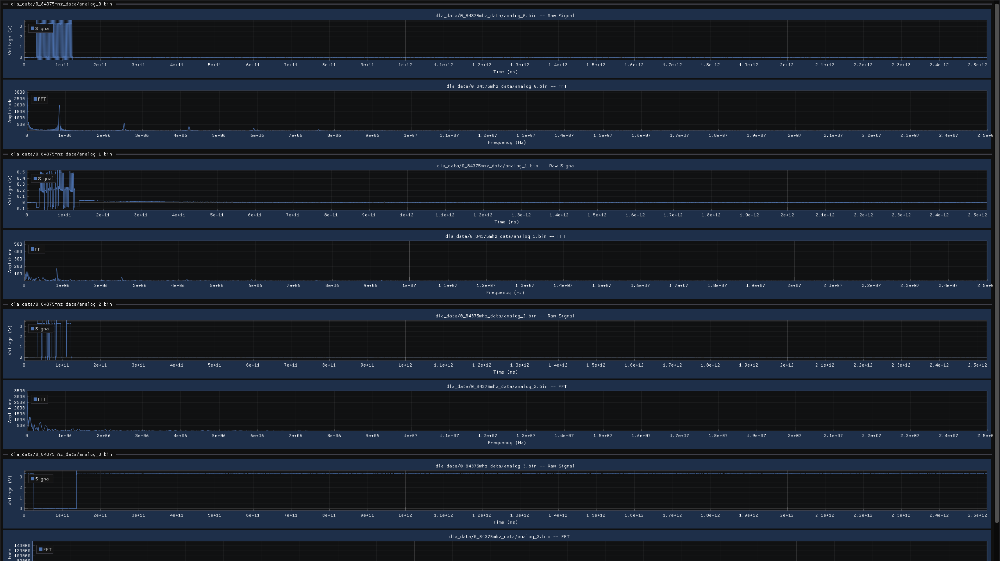

# Overview

This project is a digital signal analysis tool. The goal is to be able to take in a set
of signals and identify if they are a specific serial protocol and various properties
such as baud rate or the data payload.

This is obviously not solvable in the general case because ambiguity is possible. Even
if this were a decidable problem, solving it as a final project would not be feasible.
Instead I'll attempt various simpler problems that could build into such a solution.

What I have now is an application that can:

- Generate ideal sin waves.

- Generate ideal square waves.

- Parse in real world digital logic analyzer data.

- Insert noise into these signals

- Perform GPU accelerated FFTs

- Display plots of the given signals and FFTs

What I hope to achieve before submitting the final version is the following:

- Digitization filters that can account for setup hold (rise/fall) times

- Clock detection filters

- Clock / data correlation

- Display plots of interesting intermediate results

# Usage

```
Usage: sig_exp [--help] [--version] [--square VAR] [--sin VAR] [--noise VAR] [--input VAR...] [--verbose]

Optional arguments:
  -h, --help     shows help message and exits
  -v, --version  prints version information and exits
  --square       Generate a square wave to analyze with the given frequency in MHz
  --sin          Generate a sin wave to analyze with the given frequency in MHz
  -n, --noise    Noise scale to use. (Gaussian from 0-1 will be multiplied by this and added to the signal).
  -i, --input    path(s) to the signal data to be processed [nargs: 0 or more]
  --verbose      Enable verbose output
```

Here is a screenshot when running the `./sig_exp --input dla_data/0_84375mhz_data/analog_*.bin` command:



